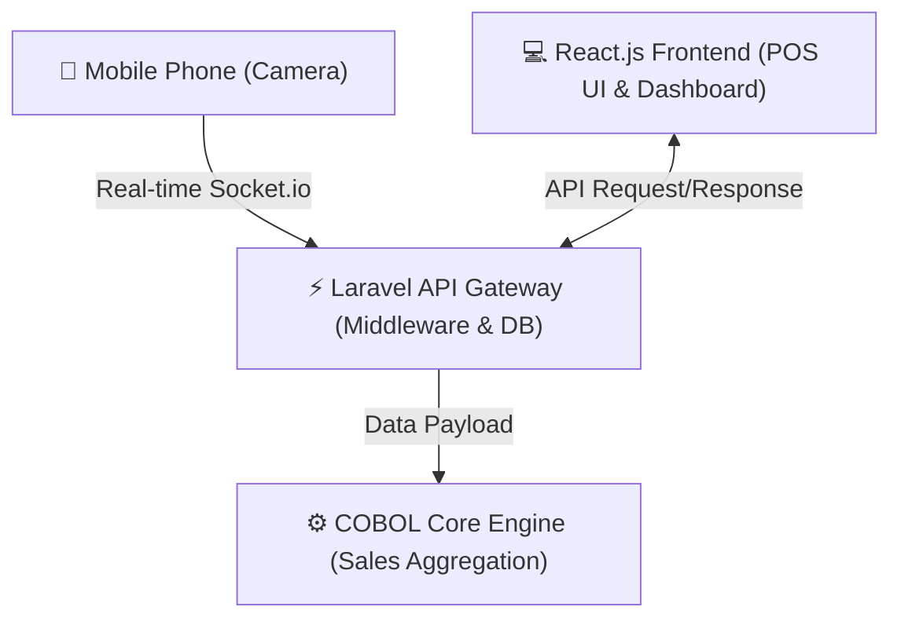

# 🛒 VaultBridge: COBOL-Integrated Mini Mart Cashiering System

**VaultBridge** is a modern Point of Sale (POS) and cashiering management system engineered for mini marts. It seamlessly bridges modern web technologies with a legacy **COBOL calculation core engine** to deliver fast financial data aggregation while drastically reducing hardware costs using real-time mobile barcode scanning.

---

## 📸 Key Highlights & Business Impact

* **Zero Extra Hardware Cost:** Transforms any smartphone into a real-time barcode scanner using WebSocket connections, eliminating the need for dedicated barcode scanners.
* **Legacy Core Integration:** Offloads complex daily and custom date-range financial calculations to a high-speed COBOL engine.
* **Fraud-Resistant Cashier Management:** Enforces strictly managed cashier shifts and mandatory end-of-shift financial reporting to eliminate cash discrepancies and unauthorized transactions.
* **Automated Workflows:** Instant receipt/voucher generation upon checkout and real-time live store metrics monitoring for store administrators.
* **Data Portability:** Full audit trail with capability to export daily and filtered sales reports to Excel (`.xlsx`).

---

## 🏗️ System Architecture

### Workflow Summary:
1. **Barcode Transmission:** Mobile scanner reads barcode -> transmits instantly via `barcode-backend` (Node.js/Socket.io) to the frontend checkout view.
2. **Transaction Processing:** React frontend sends cart data to `middleware-laravel` for database persistence and invoice creation.
3. **Financial Aggregation:** When Admin requests total sales (Daily default or dynamic `From` - `To` date ranges), Laravel feeds sales payload to `cobol-core`. The COBOL engine computes total revenue and returns calculated metrics back to Laravel to render on the Admin Dashboard.

---

## 📁 Repository Structure

Cashiering-System-VaultBridge/
├── 📂 barcode-backend/       # Node.js + Socket.io server for real-time mobile scanning
├── 📂 cobol-core/             # COBOL programs for financial data crunching & total sales aggregation
├── 📂 frontend-react/         # React.js SPA (Cashier POS View & Admin Dashboard UI)
├── 📂 middleware-laravel/     # Laravel REST API framework, Auth, Database Seeders, & Business Logic
├── 📄 docker-compose.yml      # Orchestration file for containerized environment setup
└── 📄 .gitignore

---

## 🛠️ Tech Stack

* **Frontend:** React.js, Tailwind CSS
* **Middleware & API:** Laravel (PHP)
* **Real-time Engine:** Node.js, Socket.io
* **Core Calculation:** COBOL
* **Database:** MySQL
* **Containerization:** Docker & Docker Compose

---

## 🚀 Getting Started

### Prerequisites

* Docker & Docker Compose
* Node.js (v18+)
* PHP 8.2+ & Composer
* GnuCOBOL / COBOL Compiler (if running core outside Docker)

---

## 🌐 Accessing the App

* **Web App / POS UI (React + Vite):** http://localhost:5173
* **Laravel API Gateway:** http://localhost:8000
* **Barcode Backend (Socket.io):** http://localhost:5000
* **COBOL Core Service:** http://localhost:4000
* **Laravel Reverb (WebSocket):** http://localhost:8080
* **phpMyAdmin (Database Dashboard):** http://localhost:8082

Run with Docker Compose: docker-compose up --build -d
Database Migration & Seeding: docker-compose exec backend php artisan migrate --seed

## 👥 Authors & Team Members

This project was collaboratively developed as a team project during our internship program.

* **Aung Kan Phyo**
  * GitHub: [@Aungkanphyo](https://github.com/Aungkanphyo)
  * Portfolio: [Aung Kan Phyo Portfolio](https://aungkanphyo-portfolio.vercel.app/)

* **Yu Khaing Mar Myint**
  * GitHub: [@msyukhaingmarmyint](https://github.com/msyukhaingmarmyint)

* **Swan Yi Lin**
  * GitHub: [@SwamYi23](https://github.com/SwamYi23)

* **Pan Ei Hlaing**
  * GitHub: [@Loey456](https://github.com/Loey456)
